# Handwritten Digit Detection on an FPGA

Final project for ECE 549/CS 543: Computer Vision by Edward Guo.

Please cite this github repository if this project is used as reference for your own project.

The trained model using PyTorch is in the lenet folder, the Vivado project for the SoC is located in the mnist_hw_acc folder, the Python
code for the software run on the SoC is in mnist, and the binary files for the weights and biases of the model and the test images and
labels are in sd_card_files.

## Table of Contents

1. [Introduction](#introduction)
    1. [The Rise of AI Processors for Cameras](#the-rise-of-ai-processors-for-cameras)
    2. [LeNet and MNIST](#lenet-and-mnist)
    3. [Hardware Acceleration for CNNs](#hardware-acceleration-for-cnns)
    4. [High-Level Synthesis](#high-level-synthesis)
2. [Details of the Approach](#details-of-the-approach)
    1. [Training a LeNet Model](#training-a-lenet-model)
    2. [Developing the Hardware IP](#developing-the-hardware-ip)
    3. [Incorporating the IP in the SoC](#incorporating-the-ip-in-the-soc)
    4. [Developing the Software](#developing-the-software)
3. [Results](#results)
    1. [LeNet-5 Architecture Accuracy](#lenet-5-architecture-accuracy)
    2. [System Output](#system-output)
4. [Discussion and Conclusions](#discussion-and-conclusions)
    1. [Performance Evaluation](#performance-evaluation)
    2. [Potential Improvements](#potential-improvements)
5. [References](#references)

## Introduction

In relation to the recent rise of these AI processors, I sought to develop a hardware accelerator for LeNet. LeNet is a Convolutional
Neural Network developed on the MNIST dataset in order to classify handwritten digits. Having a background within hardware development
and computer architecture, I intended to use this project to develop a working System-on-Chip (SoC) system in order to read real world
data through a webcam and perform some data pruning in order to be able to send to the hardware accelerator the image data and return
an inference. The approach to this project included training a LeNet model to obtain the parameters for the model, developing the model
in hardware using HLS, incorporating the model hardware IP within an SoC system, and incorporating webcam data into the SoC system.

### The Rise of AI Processors for Cameras

In recent years, there has been a significant increase in the integration of AI processors within cameras. These AI processors are
specialized chips designed to perform complex computations required for artificial intelligence tasks directly within the camera
hardware itself.

The primary purpose of integrating AI processors into cameras is to enable advanced features such as object detection, scene
recognition, image enhancement, and real-time analysis without relying on external computing resources. This allows cameras to offer
smarter and more responsive functionalities, including improved autofocus, better low-light performance, enhanced image stabilization,
and intelligent scene recognition for optimizing settings.

By processing AI tasks locally within the camera, latency is reduced, enabling faster response times and more efficient use of power.
This trend has been particularly notable in smartphone cameras, where AI-powered features have become increasingly prevalent, but it's
also seen in dedicated cameras, security cameras, and other imaging devices.

Overall, the integration of AI processors in cameras represents a significant advancement in imaging technology, promising smarter and
more capable cameras that can deliver better-quality photos and videos while also offering a range of intelligent features to users.

### LeNet and MNIST

The MNIST dataset consists of a large number of handwritten digit images, each of which is grayscale and has a size of 28 $\times$ 28 pixels. It
is split into a training set of 60,000 images and a test set of 10,000 images. The goal is to classify each image into one of the ten
digit classes (0 through 9).

LeNet was specifically designed by Yann LeCun, Leon Bottou, Yoshua Bengio, and Patrick Haffner to address the MNIST digit recognition
task. The architecture of LeNet was tailored to efficiently process the 28 $\times$ 28 pixel images in the MNIST dataset.

LeNet has the following specifications:

- **Input Size:** The input layer of LeNet was designed to accept grayscale images, much like those in the MNIST dataset. In its
original implementation, LeNet takes 32x32 pixel images, but it can be adapted to accommodate the 28 $\times$ 28 pixel size of MNIST images.
- **Convolutional Layers:** LeNet's convolutional layers are responsible for extracting features from the input images. By applying
convolutional filters to the input images, LeNet learns to detect patterns such as edges and textures, which are crucial for
distinguishing between different digits in the MNIST dataset.
- **Pooling Layers:** After each convolutional layer, LeNet includes a pooling layer (often max pooling). These layers reduce the
spatial dimensions of the feature maps, helping to make the network more robust to small variations in the input and reducing the
computational burden.
- **Fully Connected Layers:** Following the convolutional and pooling layers, LeNet incorporates fully connected layers. These layers
take the high-level features learned by the convolutional layers and use them to make predictions about which digit is present in the
input image. The final fully connected layer typically has ten neurons, each corresponding to one of the ten digit classes in the MNIST dataset.
- **Output Layer:** The output layer of LeNet employs a softmax activation function to produce probabilities for each digit class.
The class with the highest probability is considered the predicted digit.

Overall, LeNet's architecture was carefully crafted to excel at the task of recognizing handwritten digits in the MNIST dataset. Its success on
MNIST played a crucial role in demonstrating the power of convolutional neural networks for image classification tasks and paved the way for
further advancements in deep learning.

### Hardware Acceleration for CNNs

Designing specific hardware accelerators for Convolutional Neural Networks (CNNs) offers several advantages:

- **Efficiency:** CNNs are computationally intensive, especially in tasks like image recognition, where large amounts of data need
to be processed. Hardware accelerators can be optimized for the specific operations involved in CNNs, such as convolutions, pooling, and
matrix multiplications. This optimization results in significantly faster inference and training times compared to general-purpose processors
like CPUs or GPUs.
- **Energy Efficiency:** Hardware accelerators can be designed with power efficiency in mind, making them more suitable for deployment
in resource-constrained environments such as mobile devices or IoT (Internet of Things) devices. By offloading CNN computations to specialized
hardware, energy consumption can be minimized, prolonging battery life and reducing operating costs.
- **Parallelism:** CNN computations exhibit a high degree of parallelism, as many operations can be performed independently across
different data elements or channels. Hardware accelerators can exploit this parallelism through specialized architectures like systolic arrays
or tensor processing units (TPUs), enabling faster and more efficient processing of CNNs.
- **Scalability:** As CNN models continue to grow in size and complexity, hardware accelerators can provide scalable solutions that can
handle increasingly large models and datasets. By leveraging techniques such as model parallelism and data parallelism, hardware accelerators
can efficiently distribute the computational workload across multiple processing units, enabling the training and inference of large-scale CNNs.
- **Low Latency:** In applications where real-time responsiveness is critical, such as autonomous driving or medical imaging, hardware
accelerators can deliver low-latency inference by minimizing the time required to process input data. This is achieved through optimized hardware
architectures and reduced memory access times, ensuring rapid decision-making in time-sensitive scenarios.

Overall, designing specific hardware accelerators for CNNs allows for efficient, energy-effective, and high-performance execution of deep learning
models, enabling a wide range of applications across various domains.

### High-Level Synthesis

High-Level Synthesis (HLS) is a methodology used in digital design and electronic system-level (ESL) design, particularly in the field of hardware
design and electronic design automation (EDA). HLS aims to streamline the process of designing hardware by allowing designers to specify the
functionality of a digital circuit using a high-level programming language, such as C, C++, or SystemC, instead of traditional hardware description
languages (HDLs) like Verilog or VHDL.

In traditional digital design, designers use hardware description languages (HDLs) like Verilog or VHDL to describe the behavior and structure of
digital circuits. This process involves low-level coding, where designers must specify the details of logic gates, registers, and interconnections.

HLS provides a higher level of abstraction by allowing designers to express the desired functionality of a digital circuit using a high-level
programming language, similar to software development. HLS tools then automatically translate this high-level description into an equivalent
hardware description, optimizing it for performance, area, or power consumption.

Overall, HLS offers a more productive and efficient approach to hardware design, enabling designers to quickly prototype, iterate, and optimize
digital circuits using high-level programming languages.

## Details of the Approach

### Training a LeNet Model

The first step of this project was to create and train a LeNet model. I based this model on the LeNet-5 architecture foregoing the additional
fully-connected layer and using ReLU activation functions. The implementation of ReLU functions is due to the ease of implementation within
a C++ program. The architecture can be found in table [1](#tbl:ln_arch). The model was developed and trained in Python using PyTorch on the
MNIST dataset in order to obtain the weights and biases for each layer and saved into a binary file for use within the SoC.

<table id="tbl:ln_arch" style="margin-left: auto; margin-right: auto;">
    <tr>
        <th colspan='2' style='text-align: center;'>Layer</th>
        <th style='text-align: center;'>Feature Map</th>
        <th style='text-align: center;'>Size</th>
        <th style='text-align: center;'>Kernel Size</th>
        <th style='text-align: center;'>Stride</th>
        <th style='text-align: center;'>Activiation</th>
    </tr>
    <tr>
        <td style='text-align: center;'>Input</td>
        <td style='text-align: center;'>Image</td>
        <td style='text-align: center;'>1</td>
        <td style='text-align: center;'>32 &times; 32</td>
        <td style='text-align: center;'>-</td>
        <td style='text-align: center;'>-</td>
        <td style='text-align: center;'>-</td>
    </tr>
    <tr>
        <td style='text-align: center;'>1</td>
        <td style='text-align: center;'>Convolution</td>
        <td style='text-align: center;'>6</td>
        <td style='text-align: center;'>28 &times; 28</td>
        <td style='text-align: center;'>5 &times; 5</td>
        <td style='text-align: center;'>1</td>
        <td style='text-align: center;'>ReLU</td>
    </tr>
    <tr>
        <td style='text-align: center;'>2</td>
        <td style='text-align: center;'>Max Pooling</td>
        <td style='text-align: center;'>6</td>
        <td style='text-align: center;'>14 &times; 14</td>
        <td style='text-align: center;'>2 &times; 2</td>
        <td style='text-align: center;'>2</td>
        <td style='text-align: center;'>ReLU</td>
    </tr>
    <tr>
        <td style='text-align: center;'>3</td>
        <td style='text-align: center;'>Convolution</td>
        <td style='text-align: center;'>16</td>
        <td style='text-align: center;'>10 &times; 10</td>
        <td style='text-align: center;'>5 &times; 5</td>
        <td style='text-align: center;'>1</td>
        <td style='text-align: center;'>ReLU</td>
    </tr>
    <tr>
        <td style='text-align: center;'>4</td>
        <td style='text-align: center;'>Max Pooling</td>
        <td style='text-align: center;'>16</td>
        <td style='text-align: center;'>5 &times; 5</td>
        <td style='text-align: center;'>2 &times; 2</td>
        <td style='text-align: center;'>2</td>
        <td style='text-align: center;'>ReLU</td>
    </tr>
    <tr>
        <td style='text-align: center;'>5</td>
        <td style='text-align: center;'>Convolution</td>
        <td style='text-align: center;'>120</td>
        <td style='text-align: center;'>1 &times; 1</td>
        <td style='text-align: center;'>5 &times; 5</td>
        <td style='text-align: center;'>1</td>
        <td style='text-align: center;'>ReLU</td>
    </tr>
    <tr>
        <td style='text-align: center;'>6</td>
        <td style='text-align: center;'>FC</td>
        <td style='text-align: center;'>-</td>
        <td style='text-align: center;'>10</td>
        <td style='text-align: center;'>-</td>
        <td style='text-align: center;'>-</td>
        <td style='text-align: center;'>-</td>
    </tr>
    <caption style="caption-side: bottom">Table 1: LeNet-5 Architecture</caption>
</table>

### Developing the Hardware IP

With the use of HLS, development of each layer for hardware can be defined as a set of C++ functions. For convolution, an element-wise
multiplication accumulate can be applied for each element within the kernel operated on every element within the input. The kernel is
defined by the weights for that layer, and the starting value will be the bias for that given channel. For the max pooling layers, the
maximum value is obtained within the kernel region of 2 $\times$ 2. This is done for every set of 2 $\times$ 2 regions of the input to
obtain the max pooled output. The fully-connected layer operates a multiply accumulate on for the weights on the input and have the bias
added for the given channel. This is done for all channels. The ReLU determines the output to be 0 if the input is negative and the output
remains the same if the input is positive.

For the initial implementation of each of these layers, there are certain operations which cause the layers to not run optimally within
hardware. These were remedied by utilizing loop inversion and HLS pragmas. Loop inversion is where certain loops were moved outside other
loops in order to reduce the latency of dependencies between data reads and writes. HLS pragmas are specific coding commands to tell the
HLS compiler to restructure the code such that lower latencies can be achieved. The HLS pragmas utilized here was the PIPELINE pragma.
When placed outside for loops, the compiler will unroll the loops and pipeline the code. The ReLU function was also inlined into each
layer in order to reduce the overhead of having an extra layer of abstraction for the ReLU function.

### Incorporating the IP in the SoC

The FPGA used for this project is a Xilinx PYNQ-Z2 board displayed in figure [1](#fig:fpga) of which an SoC can be configured through Vivado. Vivado is
an EDA software used to interface with Xilinx FPGA boards. Within the software, the SoC can be configured with a block design which allows
for IPs to be placed together and connected between them for the system. Within the SoC the ZYNQ7 processing system is included in order
to have a CPU in which the software can run on. This is connected to the custom LeNet-5 hardware accelerator and a timer in order to do
hardware acceleration on the CNN and to get timing metrics or the accelerator. This system is detailed in figure [5](#fig:blk_dgm).

<figure align="center">
    <figure id="fig:fpga">
        
        <figcaption>Figure 1: PYNQ-Z2 board</figcaption>
    </figure>
    <figure id="fig:monitors">
        
        <figcaption>Figure 2: Camera Display</figcaption>
    </figure>
    <figure>
        
        <figcaption>Figure 3: Webcam</figcaption>
    </figure>
    <figure>
        
        <figcaption>Figure 4: Whiteboard</figcaption>
    </figure>
    <figure id="blk_dgm">
        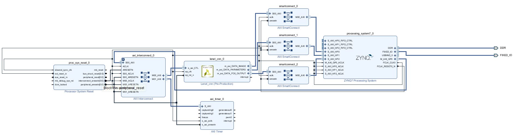
        <figcaption>Figure 5: Block Diagram</figcaption>
    </figure>
</figure>

### Developing the Software

The SoC can be interfaced through a Jupyter notebook which is one benefit of using a PYNQ FPGA board. Within the included PYNQ Python libraries,
an SoC's bitstream can be loaded onto the FPGA which allows for easier interfacing with the FPGA and being able to use other Python libraries.
The included PYNQ code also includes a bitstream which allows for USB webcam input and HDMI output to a display shown in figures [3](#fig:camera)
and [2](#fig:monitors). Using this code as a base, the image of the digit written can be captured from a whiteboard as shown in figure
[4](#fig:whiteboard). Using the cv2 library from Python, I was able to crop the image, convert the image to grayscale, apply color correction to
scale the whites and blacks accordingly to get a clearer grayscale image, and scale the image to a size of 28 $\times$ 28 as an input into the neural
network.

Once the image is obtained, the FPGA is reprogrammed with the bitstream for the hardware accelerator. This is done by creating a new overlay object
defined by the PYNQ Python library. The overlay object contains information for the SoC defined by the bitstream. From the overlay, the set of functions
used to communicate with the hardware accelerator and the different registers used to move data between the processor and the accelerator can be found.
The weights and biases that were saved from the trained model can be loaded into a buffer and sent to the hardware accelerator in order for inference
to occur within the system. In addition, the image is also fed through to the accelerator for inference. The program waits until the accelerator sends
a done signal. Once the done signal is received, the output can be read from the last layer where the result is the argmax of the output. The program
also had a verify function in order to confirm the accuracy of the neural network model in hardware.

## Results

For the hardware accelerator developed in HLS, the provided software within Vivado HLS predicts a set of metrics that the hardware would have. The main
metrics observed were the performance and area for the hardware accelerator. These come in the form of the predicted latency of the top level function
and the predicted resource utilization of the FPGA. The initial implementation of the layers, had missing latencies for most of the layers as seen in
figure [6](#fig:hls_perf0). To optimize the latencies for the hardware, temporary variable declarations and output assignments were moved to the innermost
loops and were configured to only execute on the first or last iteration of those loops. This allowed for latency information to retrieved from the
synthesis results. As observed within figure [7](#fig:hls_perf1) the latencies were very high for the convolutional layers and the area dropped. The
area decreasing is due to not having to maintain temporary variables between loops as shown in figures [9](#fig:hls_area0) and [10](#fig:hls_area1).
Placing the HLS pragma of PIPELINE within certain loops for each of the convolutional and max pooling layers results in unrolling of the loops inside
the pragma and pipelines the operations which results in reduced latencies. The improvements can be seen in figure [8](#fig:hls_perf2). Due to the unrolling
effect, the utilization of resources increased significantly for look-up tables (LUTs) as seen in [11](#fig:hls_area2). Farther levels of unrolling would
cause the predicted resource utilization to exceed the specification of the FPGA.

<figure align="center">
    <figure id="fig:hls_perf0">
        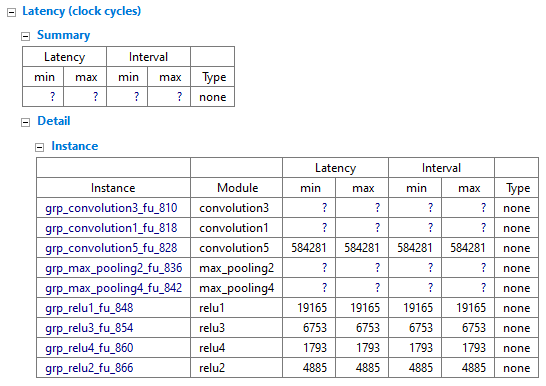
        <figcaption>Figure 6: Initial Implementation Performance</figcaption>
    </figure>
    <figure id="fig:hls_perf1">
        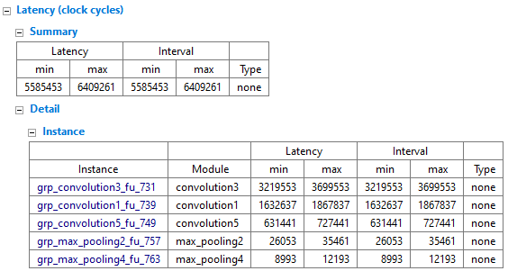
        <figcaption>Figure 7: Innermost Loop Variable Assignment Performance</figcaption>
    </figure>
    <figure id="fig:hls_perf2">
        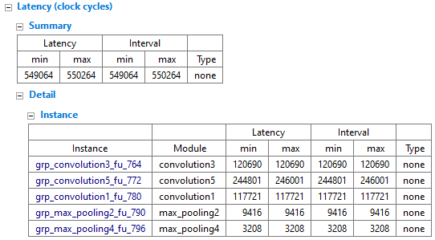
        <figcaption>Figure 8: HLS Pragma PIPELINE Performance</figcaption>
    </figure>
    <figure id="fig:hls_area0">
        
        <figcaption>Figure 9: Initial Implementation Area</figcaption>
    </figure>
    <figure id="fig:hls_area1">
        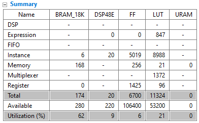
        <figcaption>Figure 10: Innermost Loop Variable Assignment Area</figcaption>
    </figure>
    <figure id="fig:hls_area2">
        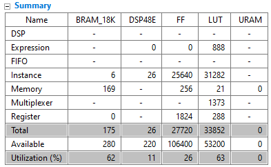
        <figcaption>Figure 11: HLS Pragma PIPELINE Area</figcaption>
    </figure>
</figure>

A comparison between the latency of the hardware accelerator against running the neural network on the embedded processor was also observed within a C++
program. This program utilized the timer IP within the SoC to determine the time differences between the two implementations. There was an observed speedup
of 1.86 times when using the hardware accelerator than that of the embedded processor.

### LeNet-5 Architecture Accuracy

The LeNet-5 model was trained on a set of 60,000 28 $\times$ 28 images provided by the MNIST dataset and tested on a set of 10,000 images
and labels. The model developed using PyTorch obtained an accuracy of 98.97\%. The hardware accelerated network was also evaluated to verify
the implementation of the neural network. The accelerator obtained an accuracy of 98.11\% for the same set of test images and labels.

### System Output

Here is a brief demonstration of how the system works from start to end within the Jupyter notebook for the system. At first the system would
read the image taken in from the webcam as shown in figure [12](#fig:webcam_output). The image is cropped to a 70 $\times$ 70 pixel image to
grab only the written digit as seen in figure [14](#fig:image_crop). The image is set to grayscale, and the pixel values are scaled to have the
written part all in black and the background to be white as shown in figures [15](#fig:image_grayscale) and [16](#fig:image_grayscale_val). The
pixel values exceeding an 8-bit value of 195 are set to completely white which can be seen in figure [17](#fig:image_grayscale_mask). The image
is then scaled to a size of 28 $\times$ 28 inverting the values and converting to integer values shown in figure [18](#fig:image_scaled). The
output result of the predictor is displayed in figure [13](#fig:result) which matches the input.

<figure align="center">
    <figure id="fig:webcam_output">
        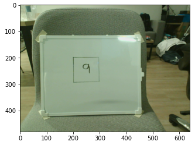
        <figcaption>Figure 12: Image Input</figcaption>
    </figure>
    <figure id="fig:result">
        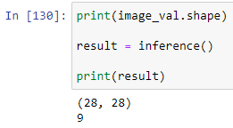
        <figcaption>Figure 13: System Result</figcaption>
    </figure>
    <figure id="fig:image_crop">
        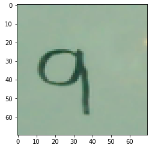
        <figcaption>Figure 14: Cropped Image</figcaption>
    </figure>
    <figure id="fig:image_grayscale">
        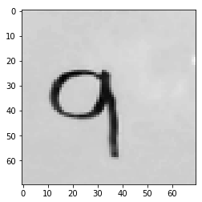
        <figcaption>Figure 15: Grayscale Image</figcaption>
    </figure>
    <figure id="fig:image_grayscale_val">
        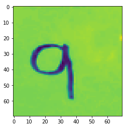
        <figcaption>Figure 16: Grayscale Image Values</figcaption>
    </figure>
    <figure id="fig:image_grayscale_mask">
        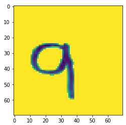
        <figcaption>Figure 17: Grayscale Image Mask</figcaption>
    </figure>
    <figure id="fig:image_scaled">
        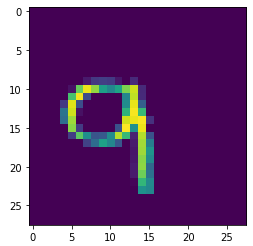
        <figcaption>Figure 18: Inverted Scaled Image</figcaption>
    </figure>
</figure>

## Discussion and Conclusions

### Performance Evaluation

While a speedup was achieved by having a customized hardware accelerator, it was not as significant compared to speedups that can be obtained
with further optimizations within HLS or more fine-grained design choices available through other hardware development methods such as RTL.
However, with those other development methods, the time to design and test the hardware would have taken significantly more time and effort
which likely would have posed a challenge due to being the sole contributor to the project.

### Potential Improvements

Currently, with how the Jupyter notebook is configured, the system will take a snapshot of a frame as the input image. An improvement to the system
that could be implemented would be a live tracking system which would update the predicted value based on a live feed from the webcam. In addition,
configuring the ZYNQ7 processor to be able to interface with both the USB input and HDMI output within the block diagram with the hardware accelerator
will lead to not having to reprogram the FPGA between runs which would also help enable live prediction.

## References

- https://www.datasciencecentral.com/lenet-5-a-classic-cnn-architecture/
- https://blog.paperspace.com/writing-lenet5-from-scratch-in-python/
- https://www.kaggle.com/datasets/hojjatk/mnist-dataset
- https://github.com/Xilinx/PYNQ
